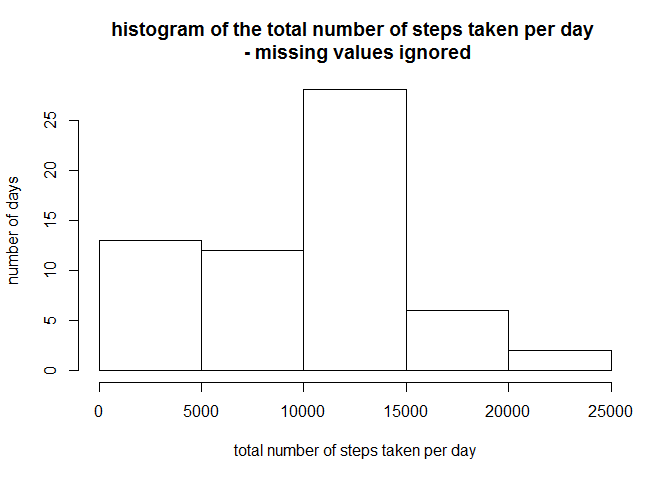
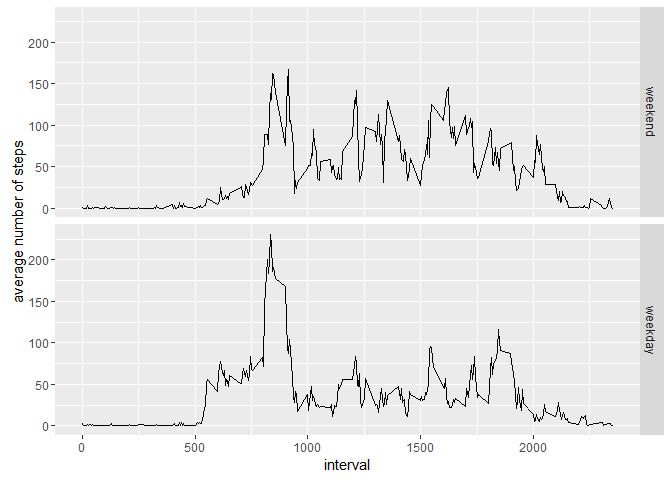

# PA1_template
MonikaZ  
15 October 2016  

This analysis makes use of data from a personal activity monitoring device.  
  
Device collects data at 5 minute intervals through out the day.  
The data consists of two months of data from an anonymous individual collected during the months of October and November, 2012 and include the number of steps taken in 5 minute intervals each day.
  
## Loading required packages and data  
Required packages were loaded, working directory set and dataset read from csv file using the code below:


```r
library(dplyr)
library(ggplot2)
setwd("C:/Users/Monika/Documents/DS_Specialization_Coursera/Reproducible Research/Wk2/repdata%2Fdata%2Factivity")
dataset0 <- read.csv("activity.csv",header=TRUE, stringsAsFactors = FALSE)
```

## What is mean total number of steps taken per day?  

First step in analysis was calculating total number of steps taken per day.  
Their distribution is shown as histogram below the code.  
Missing values were ignored.


```r
by_date <- group_by(dataset0,date)
daily_steps_total <- summarise(by_date,
                               steps_ttl = sum(steps, na.rm=TRUE))

ttl_steps_hist <- hist(daily_steps_total$steps_ttl, xlab="total number of steps taken per day", ylab="number of days", main="histogram of the total number of steps taken per day \n - missing values ignored")
```

<!-- -->
  
Also, mean and median of the total number of steps taken by day were calculated.


```r
steps_mean <- round(mean(daily_steps_total$steps_ttl, na.rm=TRUE),digits=2)
steps_median <- median(daily_steps_total$steps_ttl, na.rm=TRUE)
```

```r
steps_mean
```

```
## [1] 9354.23
```

```r
steps_median
```

```
## [1] 10395
```

## What is the average daily activity pattern?  

Next step was to look into daily activity pattern.  
For this purpose, average number of steps per time interval was caculated and time series plotted.  
(missing values removed)


```r
by_interval <- group_by(dataset0,interval)
interval_steps_avg <- summarise(by_interval,
                               steps_avg = mean(steps, na.rm=TRUE))

interval_time_series <- plot(interval_steps_avg$steps_avg ~ interval_steps_avg$interval, type="l", xlab="interval", ylab="average number of steps taken", main="average number of steps per interval - averaged across all days")
```

<!-- -->

As per graph below it's visible that maximum number of steps is taken around interval 800.  
Exact number of interval with maximum number of step is:


```r
interval_steps_avg$interval[which.max(interval_steps_avg$steps_avg)]
```

```
## [1] 835
```

## Imputing missing values  

Initial dataset contained number of days/intervals where there were missing values (coded as NA).  
The presence of missing days may introduce bias into some calculations or summaries of the data.  
Thus, missing values were replaced with average number of steps for specific interval.


```r
NA_rows <- nrow(na.omit(dataset0))

dataset1 <- merge(dataset0,interval_steps_avg,by="interval")
dataset1$steps2 <- ifelse(is.na(dataset1$steps), dataset1$steps_avg,  dataset1$steps)
dataset1 <- dataset1[order(dataset1$date,dataset1$interval),]
dataset1 <- dataset1[,c(5,3,1)]
names(dataset1)[1] <- "steps"
```

## What is mean total number of steps taken per day when missing values removed?

Then histogram of total number of steps taken per day was created again (with missing values imputed) and mean and median recalculated.  
As seen below distribution of total number of steps taken per day is less skewed and focused more around mean value.


```r
by_date1 <- group_by(dataset1,date)
daily_steps_total_1 <- summarise(by_date1,
                               steps_ttl = sum(steps, na.rm=TRUE))

ttl_steps_hist1 <- hist(daily_steps_total_1$steps_ttl, xlab="total number of steps taken per day", ylab="number of days", main="histogram of the total number of steps taken per day \n - missing values imputed")
```

<!-- -->

```r
steps_mean1 <- round(mean(daily_steps_total_1$steps_ttl, na.rm=TRUE),digits=2)
steps_median1 <- median(daily_steps_total_1$steps_ttl, na.rm=TRUE)
```

```r
steps_mean1
```

```
## [1] 10766.19
```

```r
steps_median1
```

```
## [1] 10766.19
```

## Are there differences in activity patterns between weekdays and weekends?  

Finnaly, new factor variable with two levels: "weekday" and "weekend" was created, indicating whether a given date is a weekday or weekend day.  
Plot containing a time series of the 5-minute intervals and the average number of steps taken shows different patterns between weekdays and weekends is displayed below the code.  
(missing values imputed)


```r
dataset1$date <- as.Date(dataset1$date)
weekdays_list <- c('Monday', 'Tuesday', 'Wednesday', 'Thursday', 'Friday')
dataset1$day_of_week <- factor((weekdays(dataset1$date) %in% weekdays_list), 
                   levels=c(FALSE, TRUE), labels=c('weekend', 'weekday') )


by_interval_wkd <- group_by(dataset1,day_of_week,interval)
interval_steps_avg_wkd <- summarise(by_interval_wkd,
                                steps_avg = mean(steps, na.rm=TRUE))

time_series_2 <- ggplot(interval_steps_avg_wkd, aes(interval,steps_avg)) + geom_line() + facet_grid(day_of_week ~.) + labs(y="average number of steps")
time_series_2
```

<!-- -->


